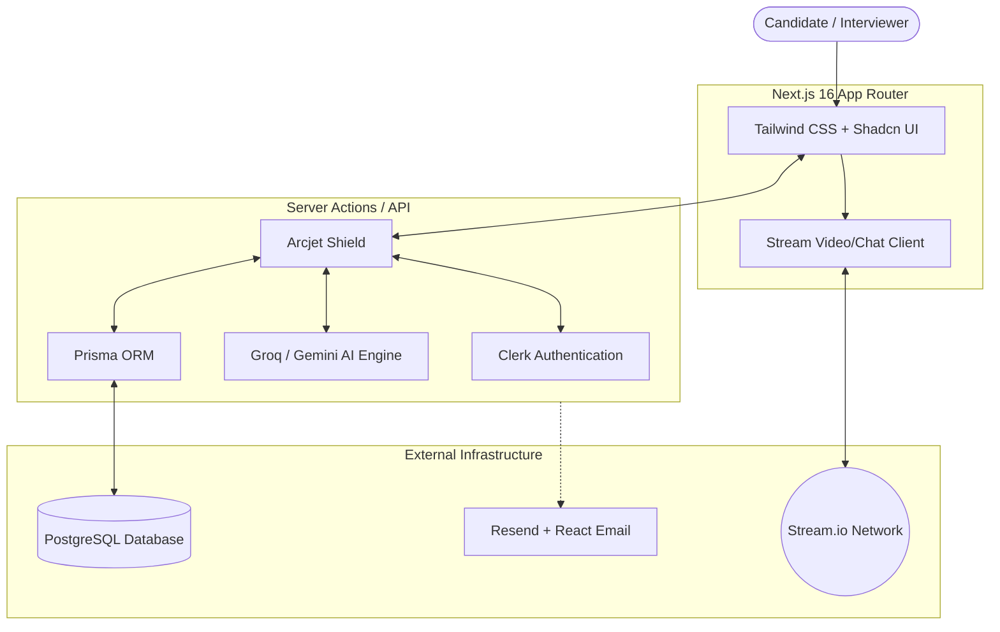

# Prept: AI-Powered Interview Marketplace 🚀

[](https://nextjs.org/)
[](https://tailwindcss.com/)
[](https://postgresql.org)
[](https://getstream.io/)
[](https://clerk.com/)

Prept is an industry-grade, AI-driven mock interview marketplace that connects candidates with senior engineers. It leverages real-time HD video, an integrated credit system, and dynamic AI co-pilots to provide an unparalleled mock interview experience.

---

## 🌟 Features

* **HD Video Calls & Persistent Chat**: Built-in 1:1 high-definition video interviews with screen sharing and recording via **Stream**. Includes persistent text chat for sharing resources before and after the interview.
* **AI Question Generator**: A live AI co-pilot generates tailored, role-specific questions (System Design, DSA, Behavioral) adjusted dynamically to the candidate's experience level.
* **Slot-Based Scheduling**: Interviewers set availability; interviewees book seamlessly. No back-and-forth negotiation required.
* **Credit System Engine**: A built-in economy. Users subscribe for monthly credits to book sessions, while interviewers earn and withdraw seamlessly.
* **AI Feedback & Analytics**: Automated, actionable post-interview analysis and feedback generated by AI.
* **Enterprise-Grade Security**: Protected by **Arcjet** for bot mitigation, rate limiting, and abuse prevention across all API routes.

---

## 🏗️ Architecture & Flow



---

## 💻 Tech Stack

### Core
* **Framework:** Next.js 16 (App Router, Server Actions)
* **Language:** JavaScript (JSX)
* **Styling:** Tailwind CSS v4, Framer Motion, Shadcn UI / Radix UI

### Infrastructure & Backend
* **Database:** PostgreSQL
* **ORM:** Prisma
* **Authentication:** Clerk
* **Communication:** Stream Video React SDK, Stream Chat
* **AI Integration:** Groq SDK (LLM integration)
* **Email:** Resend & React Email
* **Security:** Arcjet

---

## 🚀 Getting Started

### Prerequisites
* Node.js 18+
* A PostgreSQL database instance
* API Keys for Clerk, Stream, Groq, Arcjet, and Resend

### Installation

1. **Clone the repository**
   ```bash
   git clone https://github.com/your-username/ai-interview-marketplace.git
   cd ai-interview-marketplace
   ```

2. **Install dependencies**
   ```bash
   npm install
   ```

3. **Set up Environment Variables**
   Create a `.env` file in the root directory and add the following keys:
   ```env
   # Database
   DATABASE_URL="your-postgresql-url"

   # Clerk Auth
   NEXT_PUBLIC_CLERK_PUBLISHABLE_KEY=
   CLERK_SECRET_KEY=

   # Stream Video/Chat
   NEXT_PUBLIC_STREAM_API_KEY=
   STREAM_SECRET_KEY=

   # AI / LLM
   GROQ_API_KEY=

   # Security
   ARCJET_KEY=

   # Email
   RESEND_API_KEY=
   ```

4. **Initialize the Database**
   Push the Prisma schema to your database and generate the client.
   ```bash
   npx prisma db push
   npm run postinstall
   ```

5. **Run the Development Server**
   ```bash
   npm run dev
   ```
   Open [http://localhost:3000](http://localhost:3000) with your browser to see the result.

---

## 🚢 Deployment

The project is structured following the `src/` directory pattern and is 100% ready for deployment on **Vercel** or **Netlify**.

1. Push your code to GitHub.
2. Import the repository in your Vercel/Netlify dashboard.
3. Configure all the required Environment Variables.
4. Deploy! The platform will automatically run the standard `next build` command.

---

## 📄 License

This project is licensed under the MIT License.
